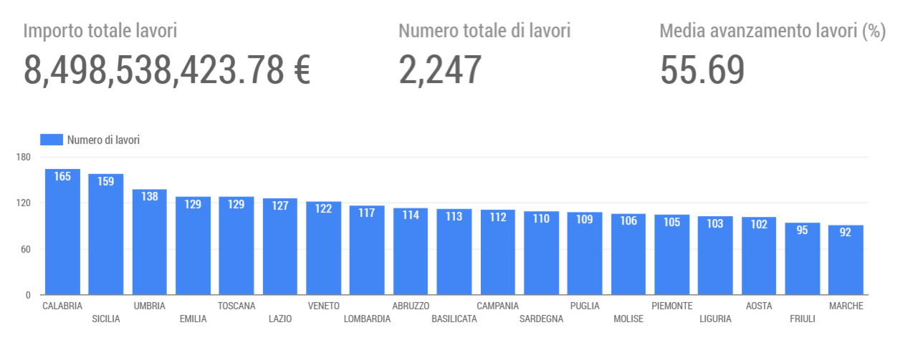

[](https://goodtables.io/github/ondata/anaslavoriincorso)

# ANAS - Lavori in corso

L'ANAS pubblica sul suo sito la pagina “[Info Cantieri](http://www.stradeanas.it/it/le-strade/lavori-corso)” per conoscere i lavori in corso per la costruzione di nuove opere e per la manutenzione straordinaria.

> Lo stato dei lavori viene aggiornato a cadenze regolari. Le informazioni e le date riportate riguardano gli “Stati di Avanzamento Lavori” comunicati dalle imprese e gli impegni contrattuali previsti per la conclusione delle opere.

I dati sono consultabili da interfaccia web, ma scegliendo prima la regione e poi le singole strade; estrarne un quadro con i dettagli per tutte le strade gestite è laborioso e richiede tempo. E non è disponibile per il download un file di insieme.

Lo script [`anas.sh`](./anas.sh) fa il download dei dati di circa 180 strade (è il dato al 17 luglio 2018) e ne crea un unico file di insieme in due formati: CSV e JSON. Quelli presenti del repo "non saranno aggiornati".

**Nota bene**: una versione del file CSV (encoding `utf-8`, separatore `,`) viene aggiornata ogni settimana ed è disponibile a questo URL [https://query.data.world/s/slpppilpda5p2ce2xmn7a3wpdpdzsx](https://query.data.world/s/slpppilpda5p2ce2xmn7a3wpdpdzsx).

[](https://datastudio.google.com/embed/reporting/17n4Casew-9cMbFE5PD5aqZg0jnsephjA/page/qy0W)


# Problematicità

## Licenza non definita, quindi dati non utilizzabili

ANAS è una S.p.A. quindi - salvo non specificato diversamente - **tutti i diritti sui dati che pubblica sono riservati**.<br>
C'è da chiedere di associare a questi dati una licenza che ne consenta il riuso.

## Dati sul posizionamento dei cantieri non utilizzabili

I dati sul posizionamento dei lavori, sono espressi in termini di kilometraggio dei punti di inizio e fine lavori lungo la "strada" interessata. Si sa ad esempio che un lavoro con un certo `id` interessa la SS113, dal km 3.2 al km 8.

ANAS in queste pagine **non rende disponibile per il download la rete stradale** (meglio il grafo) su cui sono basate queste annotazioni geografiche. Quindi l'utente può avere **solo un quadro generico e a spanne sul "dove"**.<br>
Con la rete stradale a disposizione l'utente potrebbe applicare le procedure di [`linear referencing`](https://www.wikiwand.com/en/Linear_referencing) e trasformare queste annotazione kilometriche in geometrie e quindi visualizzarle su mappa.

Gianni Vitrano (grazie) ci ha [segnalato](https://github.com/ondata/anaslavoriincorso/issues/7) che sul sito del ministero dei trasporti esiste il dataset opendata del grafo del 2015 [http://dati.mit.gov.it/catalog/dataset/grafo-stradale-anas](http://dati.mit.gov.it/catalog/dataset/grafo-stradale-anas). Si potrebbe usare per fare dei test; potrebbe essere utile allo scopo.

## Dati numerici espressi come stringhe

Nei JSON di origine i valori numerici sono espressi in questo modo `"importo_lav_principali": "438.733,76"`. Nello script è stato inserito un filtro che nel file JSON di insieme viene modificato in `"importo_lav_principali": 438733.76` (e nel CSV di insieme da `438.733,76` a `438733.76`) (vedi [#3](https://github.com/ondata/anaslavoriincorso/issues/3)).

## Record con data di ultimazione incompleta

Ci sono dei record in cui la data è espressa come `07/02/`, manca l'anno. Nello script è stato aggiunto un comando che estrae gli elementi con questa problematicità nel file [`problemi/stradeAnasNoAnnoUltimazione.csv`](./problemi/stradeAnasNoAnnoUltimazione.csv) (vedi [#4](https://github.com/ondata/anaslavoriincorso/issues/4)).

---

Grazie a [Laura Camellini](https://twitter.com/jeeltcraft) per averci messo una pulce nell'orecchio.


# Anteprima dati

## Anteprima CSV d'esempio

| dal_km | al_km  | descrizione                                                                                                                                                                                                      | tipo_lavoro                           | importo_lav_principali | importo_lav_totale | data_consegna_impresa | avanzamento_lavori | ultimazione | sospesa | impresa                                                    | id    | regione | strada | 
|--------|--------|------------------------------------------------------------------------------------------------------------------------------------------------------------------------------------------------------------------|---------------------------------------|------------------------|--------------------|-----------------------|--------------------|-------------|---------|------------------------------------------------------------|-------|---------|--------| 
| 0  | 14.7 | (CUP-F77H18000410001) RA 12 Chieti- Pescara dal km. 0+000 al km. 14+800 Lavori di ripristino di funzionalita e di completamento degli impianti di illuminazione lungo l?asta principale e gli svincoli. 1? Lotto | Lavori di manutenzione straordinaria. | 438733.76             | 506388.76         | 09/05/2018            | 4.26               | 21/09/2018  |         | ATI STACCHIO IMPIANTI SRL-IGE IMPIA SRL-TATANGELO CIRO SRL | 14076 | ABRUZZO | RA12   | 
| 0  | 14.7 | (CUP-F77H18000510001) RA 12 Chieti- Pescara dal km. 0+000 al km. 14+800 Lavori di ripristino di funzionalita e di completamento degli impianti di illuminazione lungo l?asta principale e gli svincoli. 2? Lotto | Lavori di manutenzione straordinaria. | 436022.44             | 493727.44         | 31/05/2018            | 0.00               | 28/10/2018  |         | ATI STACCHIO IMPIANTI SRL-IGE IMPIA SRL-TATANGELO CIRO SRL | 14077 | ABRUZZO | RA12   | 


## Anteprima JSON d'esempio

```json
[
  {
    "dal_km": 0,
    "al_km": 14.7,
    "descrizione": "(CUP-F77H18000410001) RA 12 Chieti- Pescara dal km. 0+000 al km. 14+800 Lavori di ripristino di funzionalita e di completamento degli impianti di illuminazione lungo l?asta principale e gli svincoli. 1? Lotto",
    "tipo_lavoro": "Lavori di manutenzione straordinaria.",
    "importo_lav_principali": 438733.76,
    "importo_lav_totale": 506388.76,
    "data_consegna_impresa": "09/05/2018",
    "avanzamento_lavori": 4.26,
    "ultimazione": "21/09/2018",
    "sospesa": "",
    "impresa": "ATI STACCHIO IMPIANTI SRL-IGE IMPIA SRL-TATANGELO CIRO SRL",
    "id": "14076",
    "regione": "ABRUZZO",
    "strada": "RA12"
  },
  {
    "dal_km": 0,
    "al_km": 14.7,
    "descrizione": "(CUP-F77H18000510001) RA 12 Chieti- Pescara dal km. 0+000 al km. 14+800 Lavori di ripristino di funzionalita e di completamento degli impianti di illuminazione lungo l?asta principale e gli svincoli. 2? Lotto",
    "tipo_lavoro": "Lavori di manutenzione straordinaria.",
    "importo_lav_principali": 436022.44,
    "importo_lav_totale": 493727.44,
    "data_consegna_impresa": "31/05/2018",
    "avanzamento_lavori": 0,
    "ultimazione": "28/10/2018",
    "sospesa": "",
    "impresa": "ATI STACCHIO IMPIANTI SRL-IGE IMPIA SRL-TATANGELO CIRO SRL",
    "id": "14077",
    "regione": "ABRUZZO",
    "strada": "RA12"
  }
]
```
